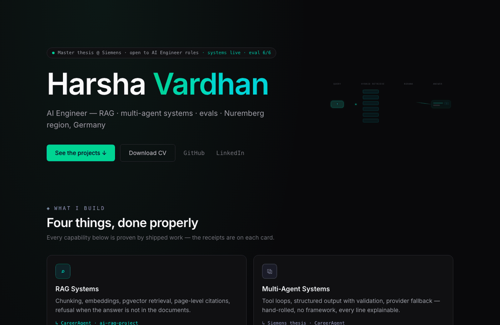

<h1 align="center">Hanumanthu Harsha Vardhan — AI Engineer Portfolio</h1>

<p align="center">
  A fast, hand-built portfolio of shipped <b>RAG</b> and <b>multi-agent AI</b> systems — every capability backed by a real project and honest metrics.
</p>

<p align="center">
  
  
  
</p>

## 🎬 Demo

<p align="center">
  
</p>

## 🧭 What's inside

Four capability areas, each proven by shipped work:

- **RAG Systems** — chunking, embeddings, vector retrieval, page-level citations, and refusal when the answer isn't in the documents
- **Multi-Agent Systems** — tool loops, structured output with validation, provider fallback (hand-rolled, no framework)
- **Evaluation & Metering** — LLM-as-judge eval suites and per-request cost metering
- **Deployment & Infra** — containerized and shipped

### Featured projects

| Project | What it is |
|---|---|
| **CareerAgent** | Multi-agent platform for the job hunt |
| **Multi-agent root-cause analysis** | Master thesis @ Siemens (industrial AI) |
| **RetrievalLab** | Advanced RAG, made visible |
| **ai-rag-project** | RAG — chat with your documents |

## 🛠️ Built with

React · TypeScript · Vite — a single-page site with client-side routing and a small markdown blog.

## ▶️ Run locally

```bash
npm install
npm run dev
```

Then open the local URL Vite prints (e.g. `http://localhost:5173`).
