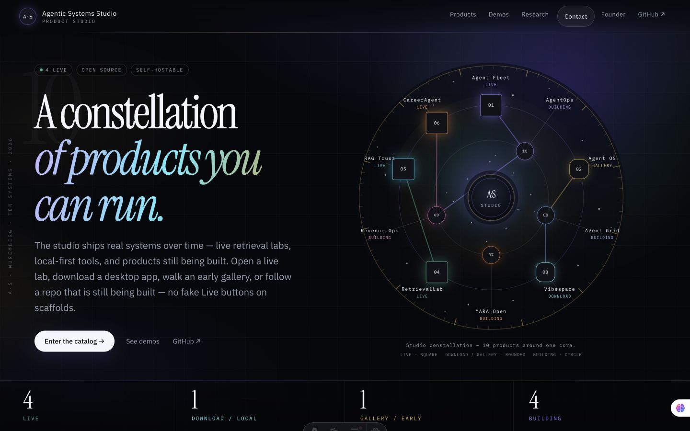
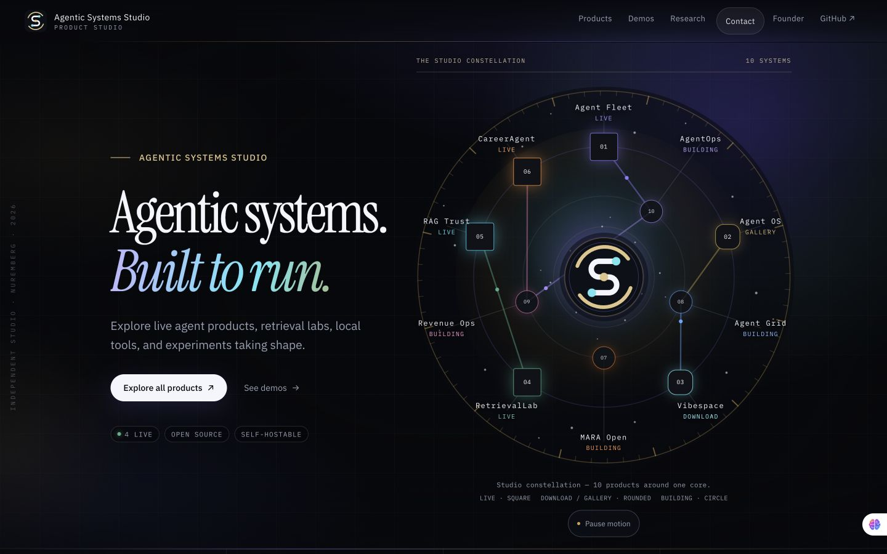

> Historical evidence: superseded by the [living product showcase](../studio-product-showcase/README.md).

# Cinematic observatory — review evidence

## Before and after

The former thin A·S identity and long hero copy are replaced by an open circular seal with a connected S constellation, a shorter headline, and a clear primary catalog action. The same SVG geometry supplies navigation, hero core, and favicon. Ten catalog products retain their destinations, status shapes, fixed labels, and factual counts.

Continuous effects add light signals along existing connections, slow atmospheric drift, a turning orbit rim, and a breathing seal. Below 640px the illustration simplifies into a seal and orbit followed by a readable two-column catalog. Product cards, demo rows, navigation, and buttons have hover and keyboard feedback.

| Before | After |
| --- | --- |
|  |  |

- [Mobile hero and product links](after-mobile.jpg)
- [Short laptop, 1280 × 720](after-short-laptop.jpg)
- [Tablet, 768 × 1024](after-tablet.jpg)
- [Motion demonstration, approximately 9.5 seconds](motion.mp4)
- Logo at native sizes:  

Screenshots are browser captures. The small floating assistant bubble is a browser extension, not Studio UI. The before capture uses the development server; after captures use the production build. The motion clip samples approximately 15 frames per second, so it is a design demonstration, not a 60fps benchmark.

## Validation — September 15–16, 2026

- `npm ci`: installed locked dependencies without changing the lockfile.
- `npm run check`: 30 Astro files, zero errors, warnings, or hints.
- `npm test`: content/ownership guards, contact tests, and production build passed.
- `git diff --check`: passed.
- Chrome desktop 1440 × 900, short laptop 1280 × 720, tablet 768 × 1024, mobile 390 × 844, and narrow mobile 320 × 568: no horizontal overflow. Short screens scroll normally.
- All ten constellation links remain present. Mobile links measure at least 80px tall, exceeding the 44px minimum. Labels and full mobile status text stay readable.
- Keyboard: mobile menu opens with Enter without JavaScript; product links show focus rings without moving their icons. Card focus gives the same lift/border/shadow as hover.
- Reduced-motion emulation: all ambient animation names become `none`, all reveal content is visible, and the control displays disabled “Reduced motion”.
- JavaScript disabled and page reloaded: all reveal content is visible, ambient effects are paused, the unused pause button is hidden, and the native menu remains usable.
- Pause/play toggles every ambient effect; scrolling the entire hero out of view pauses it. Hidden-tab pausing is implemented through `visibilitychange` and `document.hidden`; automated tab focus makes a stable background-tab measurement unreliable, so that path was source-reviewed.
- Browser error log was empty during desktop QA.
- Performance sample: paused baseline had zero layouts over about 10.7 seconds. After resuming, an 8.4-second capture interval (about 9.1 seconds including commands) recorded 776 layout operations totaling 0.117 seconds. CSS-animated SVG elements still cause browser layout work; this is not a zero-layout or cross-device 60fps claim. No per-frame JavaScript or alternating layout reads/writes are used. The final clip is a separate approximately 9.5-second capture.
- Review caught and fixed mobile node selector precedence and entrance transforms suppressing card lift. Reveal translation and card transforms now use separate CSS properties.

## Preview and deployment

The local `npx wrangler versions upload` attempt could not authenticate: the saved token had expired and could not refresh. The existing Cloudflare GitHub integration subsequently built source commit `aad5e21` successfully and returned this Worker version preview:

https://be08383d-agentic-systems-studio.rtvision7.workers.dev/

The preview was opened in Chrome and verified: approved hero copy, ten constellation links, primary `/products` action, and functioning motion control. The subsequent commit only updates these handoff notes. The Cloudflare Pages check also passed; the Worker URL above is the Studio review target.

Coordinator: review the preview and PR, merge into `cursor/agentic-systems-studio-7fff`, and use the existing Worker deployment flow when ready. Keep current resources and DNS unchanged. No additional preview setup is needed. For future manual Wrangler commands, refresh the existing account login with `npx wrangler login`.

The locked dependency install reported five existing audit findings (one low, three high, one critical). No dependency upgrades are included in this UI change.
