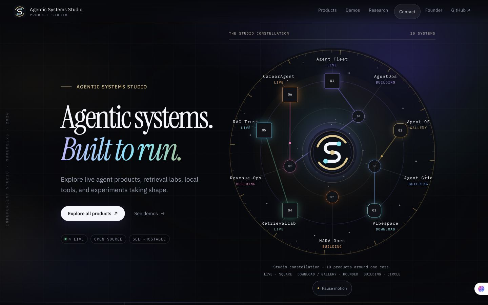
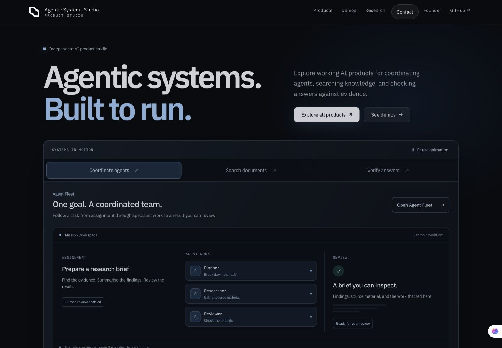

# Living product showcase — review evidence

## What changed

The Studio now leads with understandable product demonstrations: coordinate agents, search documents, and verify answers. Visitors choose the scene; it never rotates automatically. Every demonstration is labelled as an example, with a direct link to the corresponding working product.

The graphite and ice-blue identity uses IBM Plex Sans and two interlocking, chamfered modules. The same static SVG supplies the navigation, footer and favicon. The orbit, numbered nodes, totals, status-shape legend, planned-hostnames panel and generic Brief/Dispatch workflow have been removed from the homepage.

Below the hero: substantial live-product showcases, engineering evidence with source links, local tools and honest development statuses, and a concise founder/contact section. Catalog, demos and shared cards use the same visual language. Existing destinations, catalog data, contact handling and deployment configuration are preserved.

| Before | After |
| --- | --- |
|  |  |

- Full-page captures: [before](before-full.jpg), [after](after-full.jpg)
- Responsive: [390px mobile](after-mobile.jpg), [320px mobile](after-small-mobile.jpg), [320px full page](after-mobile-full.jpg), [tablet](after-tablet.jpg), [short laptop](after-laptop.jpg)
- [Workflow animation demonstration](motion.mp4)
- Logo:  

The before capture is the previous Worker version; after captures use the local production build. Full-page captures use reduced motion so below-fold entrances are immediately visible. The floating assistant bubble belongs to a browser extension, not the website. The approximately 11-second clip samples roughly 13–19 frames per second, encoded at 30fps; it demonstrates the design, not device frame-rate performance.

## Verification — September 16–17, 2026

- `npm ci`: locked dependencies installed; lockfile unchanged.
- `npm run check`: 34 Astro files; zero errors, warnings or hints.
- `npm test`: content/ownership safeguards, contact checks and production build passed.
- `node scripts/assert-catalog-growth.mjs`: builds an isolated temporary catalog with one additional live entry; verifies discovery on home/catalog and byte-identical hero markup. Actual catalog is unchanged.
- `git diff --check`: passed.
- Chrome widths 320, 390, 768, 1280 and 1440: no horizontal page overflow; short screens scroll normally. Stage controls are at least 48px tall (53px on small phones).
- All three choices render the correct panel and owned product destination. Arrow keys wrap; Home/End select the first/last scene; selection and focus stay synchronized.
- Reduced motion: all 17 ambient elements report no animation, reveal content is immediately visible, and the disabled control reads “Reduced motion”.
- JavaScript disabled: all three static demonstrations remain readable, working links remain available, and inactive controls are hidden. The native mobile menu opens with Enter.
- Pause/play controls stop and resume the continuous effects, including agent highlights and result lines. Scrolling the hero fully out of view pauses both motion regions.
- Background-tab pausing uses `visibilitychange` and `document.hidden`. Browser automation refocuses the inspected tab, so this path was source-reviewed rather than presented as a measured background-tab test.
- Independent review found a compact-visual mobile selector conflict. Fixed by applying the single-column override to compact mission/retrieval visuals. Verified at 320px: one 242px column inside a 278px container, with no internal horizontal overflow.
- Logo inspected at native 24px and 128px; its SVG geometry is static.
- Performance: a settled 1440px desktop Coordinate scene recorded **zero layout operations and zero layout duration over an 8.9-second sample**; script time was about 14ms. There is no per-frame JavaScript. This is one Chrome sample, not proof of 60fps on all devices. CSS style recalculation still occurs.

The existing locked dependencies report five audit findings (one low, three high, one critical). Dependency changes are outside this UI pass.

## Preview and handoff

See [PR #11](https://github.com/hharsha98/portfolio/pull/11) for the verified immutable Worker preview for the final source commit. The existing feature-branch alias is https://codex-studio-cinematic-observatory-agentic-systems-studio.rtvision7.workers.dev/ .

Local Wrangler authentication previously expired. The existing Cloudflare GitHub integration builds version previews on this branch without changing production. No new Cloudflare resources or DNS are required.

Coordinator: review PR #11, then merge into `cursor/agentic-systems-studio-7fff` and use the existing production Worker flow when approved. No merge or production deployment is part of this handoff.

Follow-on work: separately plan live RAG Trust instrument/upload/chunking improvements; then inspect Agent OS and define a working Mission Control milestone. RetrievalLab remains unchanged.
